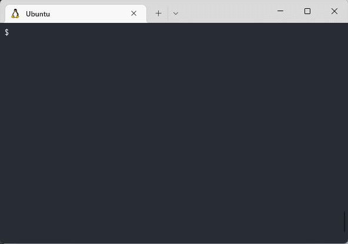

# ターミナル用 MZ-80K/C エミュレータ ttymz80

[ターミナル用PC-6001エミュレータ](http://000.la.coocan.jp/p6/basic.html#emu)を見て非常に面白いと思ったのと、ソースコード内のZ80エミュレーションコードが非常に使いやすかったので、MZ-80K/Cで同様のエミュレータを作ってみました。



## ビルド方法

src/ の中でmakeするだけです
(WSL2のUbuntu 20.04でしか確認していません)

## 使い方

```
Usage: ttymz80 [-a][-n][-w][-H][-r <ROM image>][-c <cmd>][-C <cmdfile>] [<mzt/mzf file>...]
```

* `-a`
  * ROMモニタ起動後に "LOAD[CR]" を入力することで、コマンドラインのmzt/mzfファイルを自動起動します
* `-n`
  * 画面表示を抑制します
* `-w`
  * エミュレーションを実時間に合わせず最高速で実行します
* `-H`
  * 画面表示に全角文字の代わりに半角文字を使用します。グラフィック文字はほとんど表示されなくなります
* `-r <ROM image>`
  * ROMイメージとして[MZ-NEW MONITOR](http://mzakd.cool.coocan.jp/mz-memories/mz700win.html##6)を内蔵していますが、SP-1002のROMイメージがある場合にはこのオプションでファイル名を指定することで使用できます
* `-c <cmd>`
  * エミュレータへの自動入力として与えるコマンド列を指定します
  * 英小文字は大文字に変換されます。改行を入力する場合は代わりに `|` を記述します
  * `{`～`}`で囲まれた文字列があると、後続の文字入力は画面にその文字列が表示されるまで待たされます
  * 例: ROMモニタからBASICを起動してプロンプトを待ち、コマンドを入力します
    * `ttymz80 SP5030.mzt -c 'load|{ready}10 print "hello world"|list|{ready}run|{ready}bye|'`
* `-C <cmdfile>`
  * `-c` オプションと同等の機能ですがコマンド列をコマンドラインからでなくファイルから読み込みます
* `<mzt/mzf file...>`
  * エミュレータのLOAD処理で使用するmzt/mzfファイルを並べます。最初のファイルがモニタからの"LOAD"コマンドで使用され、以降テープからのLOADを行うたびにファイルを順番に使用していきます。
  * このため、BASICを起動してプログラムをロードする場合は、[BASIC本体] [BASICプログラム] の順に指定します。

## 未対応項目

* たくさん

## 謝辞

開発には以下のソースコードやデータ等を使用させていただきました。ありがとうございます。

* [ターミナル用PC-6001エミュレータ](http://000.la.coocan.jp/p6/basic.html#emu)内のZ80エミュレーションコード (z80.c, z80.h) を使用しています
* [MZ-NEW MONITOR](http://mzakd.cool.coocan.jp/mz-memories/mz700win.html##6)を使用許諾条件に基づいて使用しています
* MZ-80K/Cの仕様については[このページ](http://www43.tok2.com/home/cmpslv/Mz80k/EnrMzk.htm)の情報を参考にしています。
